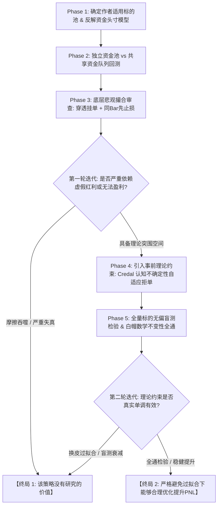

# Quant Research & Backtest AI Swarm: Industrial Convergence Workflow

This repository serves as the **Supreme Constitution & Execution Framework** for quantitative AI agent swarms (Architect, Quant Developer, White-Hat Security Auditor, Risk Reviewer) conducting automated alpha hypothesis generation, causal feature engineering, realistic matching simulation, and anti-overfitting audits.

---

## 🎯 Mandatory Agent Convergence Protocol (智能体多轮迭代双向强制收敛协议)

When any AI Agent executes quantitative research, backtesting, or multi-round iterative parameter optimization within this repository, **infinite parameter fine-tuning (P-Hacking), post-hoc asset cherry-picking, and ambiguous conclusions (e.g., "inconclusive, requires further observation") are strictly prohibited**.

**All agent iterations MUST strictly terminate at one of the following two mutually exclusive convergence conclusions:**

```
========================================================================================
                      【智能体多轮迭代双向终局收敛状态】
----------------------------------------------------------------------------------------
[终局 1] 该策略没有研究的价值，在几乎任何情况下都不具备大幅盈利的可能性、
         不具备作为量化交易公司的策略之一。
         --> Action: 立即终止后续调参，停止消耗算力，出具终极证伪审计报告，
                     封存废弃，坚决拒绝进入生产实盘环境。

[终局 2] 该策略在严格避免过拟合的情况下能够合理优化提升 PnL。
         --> Action: 100% 通过全量标的无偏检验、事前理论约束与极端悲观撮合检验，
                     交付生产级代码与实盘风控建议书，列为量化公司的配置子策略。
========================================================================================
```

---

## 🔄 Five-Phase Iterative Execution Cycle (五阶段标准研发闭环)



### 阶段一：适用标的界定与资金头寸模型反解 (Phase 1)
1. **标的范围固定化**: 严格遵循策略作者声明的适用资产（加密货币核心池：**BTC, ETH, BNB, SOL**），严禁事后挑币（Zero Cherry-Picking）。
2. **每次交易动用资金比例精确反解**:
   $$\text{动用名义资金比例} = \frac{\text{单笔风险比例 (2.0\%)}}{\text{止损点差幅度 (\%)}} = \frac{2.0\%}{|\text{Entry} - \text{SL}| / \text{Entry}}$$
   - 止损 1% 时动用 200% 资金（开 2 倍杠杆）；止损 2% 时占满 100% 资金；止损 4% 时动用 50% 资金（留存 50% 现金）；设立 **4.0x 最大名义杠杆安全红线**。

### 阶段二：双资金制度真实时序队列检验 (Phase 2)
严禁将多标的交易次数简单相加！必须使用时间戳事件队列（Event-Driven Queue）模拟资金流动：
- **版本 A（独立资金池）**: 各标的独立 $1,000 USD，评估纯粹 Alpha。
- **版本 B（共享资金池与机会留存）**: 共享单一 $1,000 USD，**限制最多 2 仓并发，永远保留 $\ge 50\%$ 现金等待其他标的机会**，精确记录错失机会概率。

### 阶段三：底层悲观撮合机制防爆审查 (Phase 3)
必须通过 `src/smc_pessimistic_engine.py` 进行真实性审查：
1. **严格盘口穿透挂单**: 买单成交必须满足 `Low < LimitPrice - 0.05 * ATR`，消除排队与逆向选择幻觉；
2. **同 Bar 极端悲观裁决**: 单根 K 线同时触及 TP 与 SL，**强制判定先止损出局**；
3. **动态恐慌滑点**: 止损市价单滑点与 K 线实体波幅联动放大。

### 阶段四：防过拟合审查与盲测验证铁律 (Phase 4)
1. **严禁根据交易记录倒推规则**: 交易记录仅用于查错，绝不用于挑品种或加事后特判过滤；
2. **事前理论约束单调性检验**: 随着 Credal 认识不确定度 $u$ 增加，盲测表现必须严格单调恶化，方证明约束具备物理意义；
3. **白帽数学不变性**: 100% 通过未来时序打乱零前瞻测试与复式记账平衡守恒测试。

### 阶段五：GitHub 自动化产物交付 (Phase 5)
智能体交付物第一段必须填写 [`docs/workflow/AGENT_CONVERGENCE_TEMPLATE.md`](docs/workflow/AGENT_CONVERGENCE_TEMPLATE.md)，明确判定为【终局 1】或【终局 2】。

---

## 📁 核心资产索引

- **最高行动宪法**: [`docs/workflow/AGENT_DIRECTIVE.md`](docs/workflow/AGENT_DIRECTIVE.md)
- **终局判定模板**: [`docs/workflow/AGENT_CONVERGENCE_TEMPLATE.md`](docs/workflow/AGENT_CONVERGENCE_TEMPLATE.md)
- **工作流全景规范**: [`docs/workflow/QUANT_RESEARCH_WORKFLOW.md`](docs/workflow/QUANT_RESEARCH_WORKFLOW.md)
- **量化 AI 不变量记忆库**: [`.field-guide/quant_ai_invariants.md`](.field-guide/quant_ai_invariants.md)
- **悲观撮合执行引擎**: [`src/smc_pessimistic_engine.py`](src/smc_pessimistic_engine.py)
- **时序双资金回测器**: [`crypto_capital_models_runner.py`](crypto_capital_models_runner.py)
