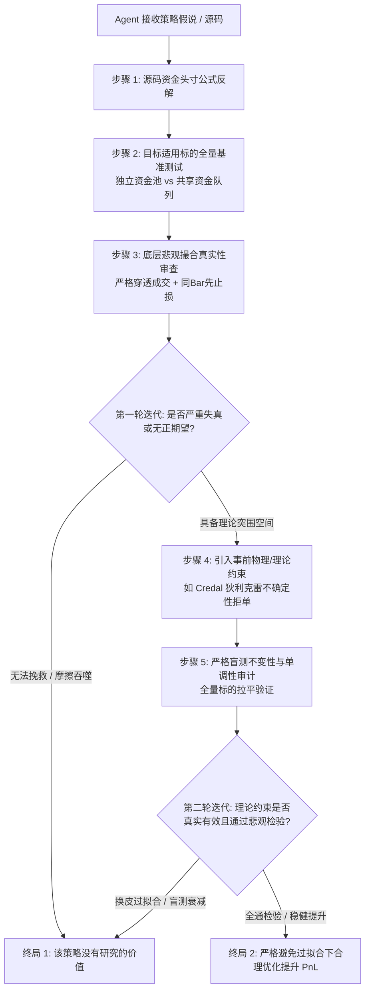

# 🤖 智能体工作流执行指令与双向终局终止协议 (AGENT_DIRECTIVE)

**适用对象**: 参与量化策略研发、特征挖掘、双引擎撮合回测与防过拟合审计的所有智能体（包括但不限于 Herdr Dispatch 架构师、研发 Agent、白帽安全审计员、审稿专家）。

---

## ⚡ 最高宪法级执行铁律 (Inviolable Rules)

任何智能体在根据本工作流仓库执行策略研究、多轮迭代优化与回测评估时，**必须且只能以以下两种终局结论之一作为任务结束的唯一停机条件（Hard Stop Condition）**：

```
========================================================================================
                      【智能体多轮迭代双向终局收敛状态】
----------------------------------------------------------------------------------------
[终局 1] 该策略没有研究的价值，在几乎任何情况下都不具备大幅盈利的可能性、
         不具备作为量化交易公司的策略之一。
         --> 触发动作: 立即终止调参，出具终极证伪报告，封存废弃，坚决不上实盘。

[终局 2] 该策略在严格避免过拟合的情况下能够合理优化提升 PnL。
         --> 触发动作: 100% 通过全量标的无偏检验、事前理论约束与极端悲观撮合，
                       交付生产级代码与风控建议书，作为量化公司的配置子策略。
========================================================================================
```

**严禁行为（违规将直接导致 Agent 输出被白帽审计员否决并打回）**:
1. 严禁无限期微调参数（P-Hacking）；
2. 严禁事后看交易记录挑选表现好的标的（Cherry-Picking）；
3. 严禁给出“未来可能有效、建议继续观察”等模棱两可的非收敛结论。

---

## 🔄 智能体多轮迭代执行路径 (Iterative Workflow Path)



---

## 📋 智能体裁决检验清单 (Convergence Checklist)

在宣布收敛至某一结论前，智能体必须在交付物中逐项核对并给出明确的证据链：

### 1. 资金动用比例公式反解（固定风险模型）
智能体必须给出源码中 Position Size 的数学公式：
- 单笔风险金额 = $\text{实时净值} \times \text{Risk\%}$
- 动用名义资金比例 = $\frac{\text{Risk\%}}{\text{止损点差幅度 (\%) } }$
- 确认波动率反比特性，确认是否设立了硬性杠杆截断（生产级必须设定 $\le 4.0x$）。

### 2. 双资金模型真实时序队列对比（严禁简单相加）
智能体必须分别运行并汇报两套资金制度：
- **独立资金池 (Isolated)**: 标的独立 $1,000 USD，评估纯粹 Alpha。
- **共享资金池 (Shared with Opportunity Reserve)**: 标的共享单一 $1,000 USD，**限制最多 2 仓并发，永远留存至少 50% 现金等待机会**，记录真实错失机会概率。

### 3. 极度悲观撮合检验（消灭成交幻觉）
- 必须通过 `src/smc_pessimistic_engine.py` 或等价实现，验证：
  - **盘口穿透成交**: 挂单必须穿透 `LimitPrice ± 0.05*ATR`；
  - **同 Bar 悲观裁决**: 触碰 TP 与 SL 时强制判先止损。

---

## 🏁 终局产物规范

- **判定为【终局 1】时**:
  - 产出 `docs/research/FALSIFICATION_AUDIT_REPORT.md`，从物理摩擦、排队逆向选择、同动性共振三大维度给出数学证伪证明，打上 `[STATUS: ABANDONED]` 标签。
- **判定为【终局 2】时**:
  - 产出生产级策略引擎、通过 100% 白帽安全测试套件、出具包含实盘限价单超时 3 Bar 自动撤单机制的配置建议书，打上 `[STATUS: PRODUCTION_READY]` 标签。
