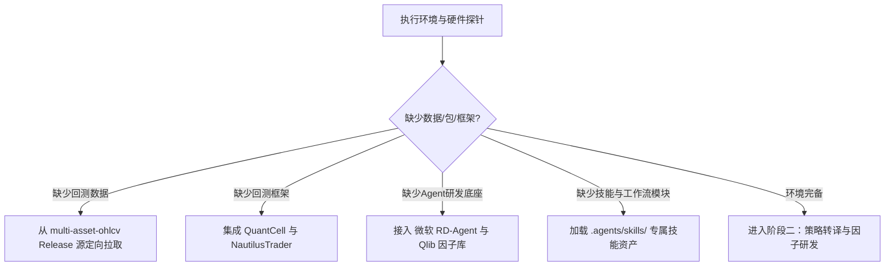

# 跨资产高频/中频量化策略研发、双引擎回测与防过拟合工业级工作流规范

本规范固化了本项目自数据拉取、环境侦测、策略转译、多 Agent/多引擎并发回测、反过拟合审计至最终蒙特卡洛压力测试的完整工程闭环。

---

## 阶段一：环境探查、资源探测与依赖自愈机制 (Phase 1: Environment & Dependency Auto-Discovery)

在启动任何回测或因子挖掘前，智能体必须执行“探针序列”，并在缺失依赖时遵循确定性源拉取：

### 1.1 数据缺失时：定向拉取源与分片加载
- **数据源仓库**: `https://github.com/JasonleeQAQ/multi-asset-ohlcv`
- **直接资产 Release 源**: `https://github.com/JasonleeQAQ/multi-asset-ohlcv/releases/download/1.0.0/{SYMBOL}USDTraw_data.zip`
- **外汇/大宗商品**: `xauusdraw_data.zip`, `usousdraw_data.zip`, `gbpusdraw_data.zip`
- **防爆内存拉取规范**:
  - 严禁全量解压所有周期；
  - 仅按需过滤提取目标周期（如 `15m`, `1h`, `5m`）；
  - 使用流式内存分块读取（`pyarrow` / `pandas.read_parquet`）并在每轮切片计算后触发 `gc.collect()`。

### 1.2 回测框架与算法库查找源
- **NautilusTrader (高精度纳秒事件撮合)**:
  - 仓库: `https://github.com/nautechsystems/nautilus_trader`
  - 适用: 订单簿深度回测、Maker/Taker 真实挂单机制撮合、纳秒时序对齐。
- **QuantCell (事件驱动/轻量化撮合底座)**:
  - 仓库: `https://github.com/pengwow/QuantCell`
  - 适用: 基于 `axon_quant` 高性能 Rust 内核的资金曲线与截面调度。
- **微软 Qlib (高维 Alpha 因子库)**:
  - 仓库: `https://github.com/microsoft/qlib`
  - 适用: Alpha101 / Alpha158 因子体系构建、截面因子 IC/IR 分析、波动率与流动性特征抽取。
- **微软 RD-Agent (量化研发自动化智能体架构)**:
  - 研报与规范: `https://www.microsoft.com/en-us/research/articles/rd-agent-quant/`
  - 适用: Hypothesis（因子假设） $\to$ Coding（向量化实现） $\to$ Evaluation（事件检验） $\to$ Feedback Loop（自动剪枝）。

---

## 阶段二：策略规范转译与微观结构因子提取 (Phase 2: Strategy Adaptation)

将 SMC（Smart Money Concepts）或任意 Pine Script / 伪代码策略转译为标准引擎完全读懂的数据结构：
1. **统一特征输出接口**:
   - `Swing High/Low` 枢轴极值点检测（自适应周期 $L \in [5, 10]$）；
   - `Order Block (OB)` 订单块标记（伴随成交量倍数 $V_{ratio} \ge 1.3 \sim 1.5$）；
   - `Fair Value Gap (FVG)` 公允价值缺口（$Gap \ge 0.4 \times ATR$）；
   - `Liquidity Sweep` 假突破扫损识别（$High_t > HH_{t-1} \land Close_t < HH_{t-1}$）；
   - `Confluence Score` 多因子连续打分映射（0 ~ 100分）。
2. **非对称多空与早期保本缓冲机制 (Early BE Buffer)**:
   - 浮盈达 $0.7R \sim 0.8R$ 时，将止损价上移至 $\text{Entry} + 0.15 \times ATR$（多头）或下移至 $\text{Entry} - 0.15 \times ATR$（空头），锁定微利防止震荡扫损。

---

## 阶段三：多 Agent 并行滚动窗口回测 (Phase 3: Walk-Forward Backtesting)

为保证统计有效性与防过拟合，统一执行**自然年滚动窗口（Natural-Year Walk-Forward Split）**：

| 切片属性 | 数据比例 | 核心目标 | 约束条件 |
| :--- | :---: | :--- | :--- |
| **样本内 (In-Sample, IS)** | **80%** | 参数拟合、因子有效性初步筛查 | 必须计入完整手续费与滑点 |
| **样本外 (Out-of-Sample, OOS)** | **20%** | 策略真实泛化能力审计 | 冻结所有超参数，严格零前视偏差 (Look-ahead Free) |

- **费用与冲击模型**:
  - **Taker 费率**: 0.05% (5 bps)；
  - **Maker 费率**: 0.02% (2 bps)；
  - **滑点冲击**: 0.05% (5 bps)；
  - **动态仓位**: 严格单笔风险暴露 2.0%：$\text{Size} = \frac{\text{Equity} \times 2\%}{\text{StopDistance}}$。

---

## 阶段四：防过拟合与极端风险压力测试 (Phase 4: Anti-Overfitting & Robustness)

本工作流强制要求执行三层防过拟合与压力测试体系：
1. **跨资产横截面泛化测试 (Cross-Asset Validation)**:
   - 策略必须在加密主流币（BTC, ETH, SOL, BNB, NEAR）与传统外汇/商品（XAUUSD, USOUSD, GBPUSD）跨资产池同步比对，检验策略是否仅在特定高波动资产上伪盈利。
2. **2,000 次蒙特卡洛 Bootstrap 重采样压力测试 (Monte Carlo Simulation)**:
   - 从样本外真实成交交易序列中随机有放回/无放回重采样 2000 条资金演进路径（每条 200 笔交易）；
   - 输出 **破产概率 (Probability of Ruin)**（净值回撤超 50% 的比例，强制目标 = 0.00%）；
   - 计算 **95% 置信度最大回撤**、**99% 极端尾部回撤**、**95% 在险价值 (VaR 95%)** 与 **95% 条件在险价值 (CVaR 95%)**。
3. **参数敏感度高原分析 (Parameter Plateau)**:
   - 阈值在 $\pm 10\%$ 浮动时，收益曲线不得发生悬崖式跌落。

---

## 阶段五：产物归档与 GitHub 自动化交付 (Phase 5: Artifacts Delivery)

- **标准化交易日志**: `results/unified/trades/*.json` 与 `results/portfolio/trades/*.json`
- **指标全量数据表**: `all_backtest_summary.csv` 与 `portfolio_summary.csv`
- **分析报告**: `FINAL_BACKTEST_REPORT.md` 与 `HIGH_FREQUENCY_SMC_QLIB_REPORT.md`
- **代码仓库远程同步**: 自动推送到指定的 GitHub 私有/公有代码资产库。
