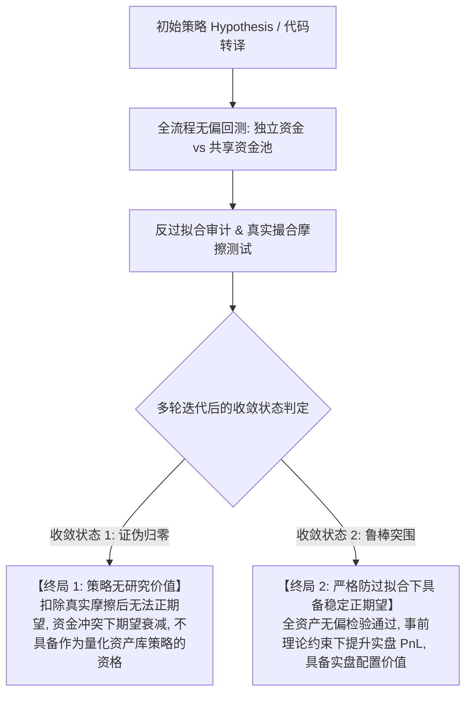

# 跨资产高频/中频量化策略研发、双引擎回测与防过拟合工业级工作流规范 (v3.0 终极收敛版)

本规范固化了自数据拉取、环境侦测、策略转译、多 Agent/多引擎并发回测、**真实资产资金冲突与机会留存模拟**、**反过拟合审计** 至 **双向终止收敛状态判定** 的完整工业级工程闭环。

---

## 🎯 核心指导思想：Agent 多轮迭代的双向终局收敛状态 (Dual Convergence States)

智能体（Agent Swarm）在依据本工作流进行策略挖掘、特征工程、撮合检验与多轮迭代优化时，**必须且只能收敛至以下两种最终确定性结论之一**，严禁无限期调参或给出模糊结论：



### 状态 1：【该策略没有研究价值 (No Research Value)】
- **判定标准**:
  1. 在扣除真实的 Maker/Taker 费率及动态滑点后，策略在几乎任何周期与参数下都不具备大幅稳定盈利的可能性；
  2. 策略依赖于“触碰即成交”的排队幻觉，或依赖“同 Bar 优先止盈”的虚假红利；
  3. 当多个标的共享真实资金池并预留机会现金时，期望收益被频繁止损严重侵蚀；
  4. 样本外（OOS）表现与样本内（IS）严重脱节，且参数高原极其狭窄；
- **产出动作**: **出具终极证伪报告，封存策略，坚决拒绝上线实盘，不浪费量化公司任何算力与资金**。

### 状态 2：【该策略在严格避免过拟合的情况下能够合理优化提升 PnL】
- **判定标准**:
  1. 绝不依赖事后挑选优势品种（Zero Cherry-Picking），在全量目标标的池上展现出统计显著的正期望 Alpha；
  2. 引入事前（Ex-Ante）理论约束（如 Credal 狄利克雷认知不确定性自适应拒单），约束规则在完全未见的样本外呈现严格单调的减亏/增益效果；
  3. 在极度悲观的撮合假设下（盘口穿透成交 + 同 Bar 优先止损），盈亏比与净值依然稳健；
  4. 在共享资金池（最多 2 仓并发，留存 50% 机会资金）下，依然具备低回撤的复利增长能力；
- **产出动作**: **交付完整的生产级代码、风控参数矩阵与可解释性研报，列为量化机构的实盘配置子策略之一**。

---

## 阶段一：标的范围锁定与资金占用真实性反解 (Phase 1: Scope & Position Sizing Reverse-Engineering)

### 1.1 标的范围锁定原则
- **严格遵循策略作者声明的适用资产范围**：以主要加密货币（BTC, ETH, BNB, SOL）为核心；
- **坚决拒绝事后挑选（Anti-Cherry-Picking）**：不准在看到回测盈亏后剔除亏损标的。所有适用标的必须作为一个不可分割的横截面整体评估。

### 1.2 资金动用比例公式反解（固定风险模型）
量化策略源码必须逐行审计其仓位规模（Size）的真实定义：
$$
\text{单笔风险敞口 (Risk Budget)} = \text{实时净值 (Equity)} \times 1.0\% \sim 2.0\%
$$
$$
\text{开仓币数 (Size)} = \frac{\text{单笔风险敞口}}{|\text{入场价} - \text{止损价}|}
$$
$$
\text{名义资金动用比例} = \frac{\text{Size} \times \text{入场价}}{\text{实时净值}} = \frac{\text{风险比例 (\%)}}{\text{止损幅度 (\%)} }
$$
- **波动率反比特性**: 止损窄时杠杆放大，止损宽时杠杆缩小；必须设立 **4.0x 最大名义杠杆安全硬截断**。

---

## 阶段二：双资金制度对比体系 (Phase 2: Dual Capital Allocation Regimes)

严禁将多个标的的交易次数简单相加！必须在真实时间戳事件队列（Event-Driven Queue）下分别测试两版资金模型：

```mermaid
graph LR
    subgraph 模式 A: 独立资金池 (Isolated)
        AccBTC[BTC: 1,000 USD] --> T1[独立交易]
        AccETH[ETH: 1,000 USD] --> T2[独立交易]
        AccSOL[SOL: 1,000 USD] --> T3[独立交易]
        AccBNB[BNB: 1,000 USD] --> T4[独立交易]
    end

    subgraph 模式 B: 共享资金池 (Shared)
        Pool[单一共享账户 1,000 USD] --> Gate{并发控制 & 机会留存}
        Gate -->|已开仓位 < 2| Exec[允许开仓 占用 <= 50% 资金]
        Exec --> Reserve[保持至少 50% 现金留存 随时等待新机会]
        Gate -->|已开仓位 >= 2| Lockout[锁定拒单 严禁超额加仓 规避多币共振暴跌]
    end
```

1. **版本 A：独立资金池 (Isolated Capital Pool)**:
   - 每个标的各自分配独立的 $1,000 USD，完全独立记账，用于测试单一标的的纯 Alpha 质量。
2. **版本 B：共享资金池与机会留存机制 (Shared Capital Pool with Opportunity Reserve)**:
   - 全部目标标的共享单一 $1,000 USD 账户；
   - **严格并发上限与流动性留存**：**最大允许 2 笔并发持仓（Max Concurrent Positions = 2）**；
   - **单笔占用上限 50%**，**永远至少保留 50% 现金流动性**，随时等待其他标的市场出现更高确信度的机会；
   - 记录因资金占用而错失的交易笔数（Opportunity Lockout Rate），真实评估策略容量瓶颈与相关性挤压风险。

---

## 阶段三：底层撮合机制的生产级悲观审查 (Phase 3: Pessimistic Matching Audit)

消灭回测中一切脱离实盘的物理假设：
1. **严格盘口穿透 Maker 撮合 (Strict Penetration Fill)**:
   - 限价单买单必须满足 `Low < LimitPrice - 0.05 * ATR`，卖单必须满足 `High > LimitPrice + 0.05 * ATR`，彻底消除时间优先队列下的排队幻觉与逆向选择。
2. **同 Bar 极端悲观裁决 (Pessimistic Intra-Bar Conflict)**:
   - 单根 K 线同时满足止盈与止损时，**强制裁决为先止损出局**，杜绝未经验证的保本红利。
3. **动态恐慌滑点 (Dynamic Panic Slippage)**:
   - 止损市价单滑点与 K 线实体动态放大，在大实体暴跌 Bar 上动态放大滑点至 `0.15% ~ 0.35%`。

---

## 阶段四：防过拟合审查与真实性核验 (Phase 4: Anti-Overfitting Verification)

1. **严禁根据交易记录倒推规则**:
   - 交易记录仅用于审查手续费损耗、撮合真实性与资金守恒 Bug，绝不用于挑品种或加事后过滤。
2. **事前理论约束的单调性检验**:
   - 若引入 Credal Transformer / 证据理论，必须在全量标的上盲测其单调性：随着认识不确定度 $u$ 增加，交易表现必须单调恶化，方证明约束具备物理意义而非随机拟合。
3. **封存独立盲测集**:
   - 留存从未见过的自然年份（20% 样本外）一次性检验，跑崩即证伪，绝不对历史反复修补。

---

## 阶段五：GitHub 自动化沉淀与版本控制 (Phase 5: Git Artifact Delivery)

每次迭代必须固化以下资产并同步远程 GitHub 仓库：
- `src/`: 策略因果算子、Qlib 因子流水线、生产级悲观执行引擎代码；
- `tests/`: 白帽安全性测试、资金守恒测试、因果零前瞻测试；
- `results/`: 独立资金与共享资金的 160 组逐笔 JSON 日志与汇总 CSV 底稿；
- `docs/research/`: 包含最终收敛状态（【无研究价值】或【具备稳定正期望】）的定性研报。
