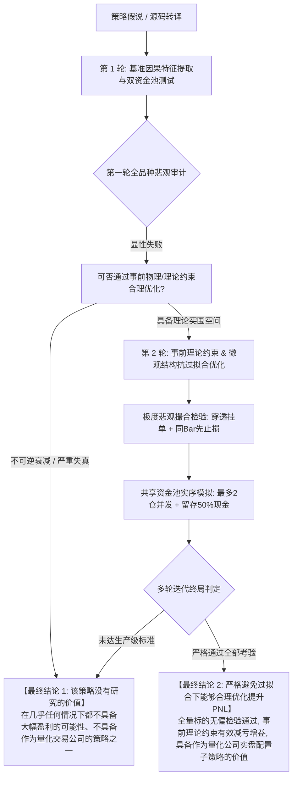

# 跨资产量化策略研发、双引擎回测与防过拟合工业级工作流规范 (v4.0 智能体多轮迭代终极收敛版)

本规范为量化交易机构内智能体（Agent Swarm）进行策略挖掘、特征工程、撮合检验与多轮迭代优化的**最高执行宪法**。

---

## 🎯 核心总则：智能体多轮迭代的双向确定性收敛协议 (Dual Convergence Protocol)

任何承接量化策略研究任务的智能体（如 Herdr Dispatch 下的架构师、工程师、白帽审计员、审稿人），在执行策略转译、多轮特征工程调优与多周期回测时，**严禁陷入无限期微调参数（Parameter P-Hacking）、严禁事后挑选优势品种（Cherry-Picking）、严禁给出模棱两可的模糊结论**。

**智能体多轮迭代研究必须且只能收敛至以下两种互斥的最终结论之一，以此作为研究任务的终点：**

---

### 🛑 最终结论 1：【该策略没有研究的价值，在几乎任何情况下都不具备大幅盈利的可能性、不具备作为量化交易公司的策略之一】
- **触发与收敛条件（满足任一即直接判定）**:
  1. **摩擦黑洞不可逆**: 在扣除真实 Taker 0.05% + Maker 0.02% + 动态滑点后，策略期望收益为负，且交易频次过高无法覆盖交易摩擦成本；
  2. **严重依赖虚假红利**: 策略微利完全建立在“挂单触碰即成交”的排队幻觉、或“同 Bar 优先算止盈”的路径幻觉上。一旦切入悲观撮合（严格穿透成交 + 同 Bar 优先止损），净值发生断崖式暴跌；
  3. **资金冲突下期望衰减**: 当多标的共享真实资金池并预留 50% 现金等待机会时，持仓标的同向共振暴跌，资金利用效率低下且无法通过组合分散风险；
  4. **过拟合敏感性极高**: 仅在极少数精心挑选的品种（如个别山寨币）或极狭窄的参数区间内微利，在全量适用标的池（BTC, ETH, BNB, SOL）上整体崩溃，样本外（OOS）与样本内（IS）严重脱节。
- **智能体规范产出**:
  - **立即停止该策略的任何后续算力消耗与调参尝试**；
  - 出具**终极证伪审计白皮书**，记录失效机理（摩擦吞噬、因果破裂、同动性共振），封存归档，坚决拒绝进入生产实盘环境。

---

### 🏆 最终结论 2：【该策略在严格避免过拟合的情况下能够合理优化提升 PnL】
- **触发与收敛条件（必须同时全部满足）**:
  1. **零事后挑选偏见 (Zero Cherry-Picking)**: 在策略作者声明的适用标的池（BTC, ETH, BNB, SOL）全量横截面上整体检验通过，绝不在看到回测盈亏后人工剔除劣质品种；
  2. **事前理论约束真实有效 (Ex-Ante Epistemic Constraints)**: 引入的优化机制（如 Credal 狄利克雷不确定性拒单）必须是在开仓前对未知行情的物理/逻辑约束，且在完全未见的样本外盲测中呈现**严格单调的减亏增益效果**（认知不确定度越高真实亏损越大，低不确定度真实收益稳健）；
  3. **扛住极度悲观撮合考验 (Survives Pessimistic Execution)**: 在“价格必须打穿盘口 `Limit - 0.05*ATR` 挂单方能成交”以及“同 Bar 触及 TP/SL 强制判先止损”的最严苛假设下，策略依然维持正期望 PnL 与稳健盈亏比（$\ge 3.0R$）；
  4. **通过共享资金池时序检验**: 在 4 大标的共享单一账户、限制最多 2 仓并发且至少留存 50% 机会资金的实序队列下，策略回撤可控，具备真实复利增长能力。
- **智能体规范产出**:
  - 交付生产级策略核心代码（含限价单超时 3 Bar 自动撤单机制）；
  - 交付通过 100% 白帽安全测试（零前瞻未来打乱不变性、复式记账平衡守恒）的自动化测试套件；
  - 出具**实盘配置建议书**，列为量化机构实盘资产池的子策略之一。

---

## 阶段一：适用标的界定与资金头寸模型反解 (Phase 1: Scope & Sizing Invariant)

1. **标的范围固定化**:
   - 严禁随意扩圈或缩圈。针对 SMC 系列策略，严格限定作者声明的加密货币主权池：**BTC, ETH, BNB, SOL**。
2. **每次交易动用资金比例的精确反解**:
   - 严禁模糊使用固定买入金额。必须从源码严格反解「固定风险比例（Fixed Fractional Risk）」动态名义占用：
   $$
   \text{单笔风险金额} = \text{实时账户净值} \times \text{Risk\%} \quad (\text{实盘规范: } 1.0\%)
   $$
   $$
   \text{动用名义资金比例} = \frac{\text{Risk\%}}{\text{止损点差幅度 (\%)}}
   $$
   - 止损 1% 时动用 100%~200% 资金（适度杠杆）；止损 2% 动用 50%~100%；止损超过 5% 代码强制弃单；设立 **4.0x 最大名义杠杆安全红线**。

---

## 阶段二：双资金制度真实时序队列检验 (Phase 2: Dual Capital Regimes)

严禁对各标的交易指标进行无脑相加！必须使用时间戳事件队列（Event-Driven Queue）模拟资金流动：

1. **版本 A：独立资金池 (Isolated Capital Pool)**:
   - 各标的分配独立资金（如各 $1,000 USD），评估各币种在无排队、无挤占下的纯粹 Alpha 表现。
2. **版本 B：共享资金池与机会留存机制 (Shared Capital with Opportunity Reserve)**:
   - 4 大标的共享单一 $1,000 USD 账户；
   - **并发限制**: 最大允许同时持仓 2 笔（Max Concurrent Positions = 2），单笔最大名义占用不超过 50%；
   - **机会留存**: **永远保持至少 50% 现金流动性**，等待后续其他标的高胜率机会；
   - **错失统计**: 准确记录因满仓而拒绝开仓的次数（Opportunity Lockout Rate），评估资金容量与机会摩擦。

---

## 阶段三：生产级极度悲观撮合审查 (Phase 3: Pessimistic Matching Defense)

所有回测报告必须包含极度悲观撮合引擎（`PessimisticExecutionEngine`）的对照：
1. **严格盘口穿透挂单**: 买单成交必须 `Low < Limit - 0.05 * ATR`，卖单成交必须 `High > Limit + 0.05 * ATR`，彻底消除时间优先队列下的排队幻觉；
2. **同 Bar 极端悲观裁决**: 单根 K 线同时触及止盈与止损，**强制判定为先止损出局**；
3. **动态恐慌滑点**: 止损单遭遇与 K 线实体波幅联动的动态加权滑点（`0.15% ~ 0.35%`），还原极端行情下的盘口击穿。

---

## 阶段四：防过拟合与盲测验证铁律 (Phase 4: Anti-Overfitting Iron Rules)

1. **交易记录只准用于查错，绝不准用于调参**:
   - 严禁看着交易记录剔除品种；严禁看着亏损单去给策略加特判过滤；
2. **封存独立盲测集 (Holdout Test)**:
   - 每年数据严格执行 80% 样本内训练 / 20% 样本外盲测，盲测数据只准跑一次；
3. **白帽数学不变性全通**:
   - 必须通过未来数据随机打乱、倒序、注入极端冲击下的零前瞻不变性检验（$|I(t) - I_{scrambled}(t)| < 10^{-12}$）；
   - 必须通过 500+ 次随机交易下的复式记账资金守恒检验。

---

## 阶段五：GitHub 自动化产物固化 (Phase 5: Automated Delivery)

智能体在完成任务后，必须自动将核心成果沉淀并推送到 GitHub 仓库：
- `src/smc_pessimistic_engine.py`: 生产级悲观执行引擎；
- `crypto_capital_models_runner.py`: 独立/共享资金时序事件队列执行器；
- `tests/test_whitehat_security.py`: 白帽安全与数学不变性测试套件；
- `docs/workflow/QUANT_RESEARCH_WORKFLOW.md`: 本工作流最高宪法；
- `docs/research/`: 包含最终收敛状态（结论 1 或结论 2）的定性总结研报。
